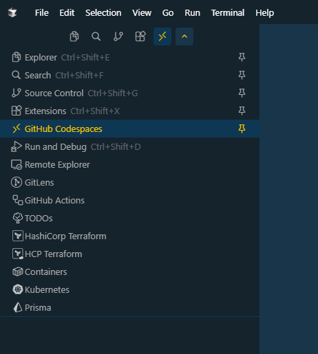

# Cursor Codespaces

A VS Code/Cursor extension that provides seamless GitHub Codespaces connectivity via GitHub CLI. Connect to your Codespaces with a single click, directly from your editor.

## Features

- 🚀 **One-Click Connection** - Connect to any Codespace with a single click
- 📋 **Custom Explorer View** - Browse all your Codespaces in a dedicated sidebar view
- 🔄 **Auto-Start** - Automatically starts shutdown Codespaces before connecting
- ⚡ **Real-Time Status** - See the current state of all your Codespaces (Available, Shutdown, Starting, etc.)
- 🔐 **Automatic SSH Config** - Manages SSH configuration automatically
- 🎯 **Smart Status Bar** - Quick access button in the status bar
- 🔄 **Auto-Refresh** - Always shows the latest Codespace status

## Requirements

- **GitHub CLI (`gh`)** - Must be installed and authenticated
  - Install from: https://cli.github.com/
  - Authenticate with: `gh auth login`
  - Required scope: `codespace`
- **VS Code/Cursor** - Version 1.99.0 or higher
- **Remote-SSH Extension** - Required for connecting to Codespaces
  - **VS Code**: Install "Remote - SSH" (ms-vscode-remote.remote-ssh) from the marketplace
  - **Cursor**: Usually built-in, but on some platforms (e.g., Linux) you may need to install it manually
  - The extension will prompt you to install it if it's missing

## Installation

### From VS Code Marketplace

1. Open VS Code/Cursor
2. Go to Extensions view (`Ctrl+Shift+X` or `Cmd+Shift+X` on Windows/Linux, `Cmd+Shift+X` on Mac)
3. Search for "Cursor Codespaces"
4. Click "Install"
5. The extension will be installed and ready to use

### For Developers (Building from Source)

If you want to build from source or contribute:

```bash
git clone https://github.com/orbiktech/cursor-codespaces-extension.git
cd cursor-codespaces-extension
npm install
npm run compile
vsce package
```

Then install the generated `.vsix` file:
1. Go to Extensions view
2. Click the `...` menu and select "Install from VSIX..."
3. Select the generated `.vsix` file

## Usage

### Method 1: Custom Explorer View (Recommended)

1. **Open the Codespaces Explorer**
   - Click the "GitHub Codespaces" icon in the Activity Bar (left sidebar)
   - The icon appears in the sidebar menu (see image below)
   - Or use the Command Palette: `Cursor Codespaces: Show Codespaces Explorer`

   
   
   *The GitHub Codespaces icon highlighted in the Activity Bar sidebar*

2. **View Your Codespaces**
   - All your Codespaces are listed with their current status
   - Status indicators:
     - 🟢 Green circle = Available
     - 🔴 Red circle = Shutdown
     - 🟡 Yellow spinning = Starting/Other states
   - **Note:** If GitHub CLI is not installed, you'll see installation instructions with a link to download it

3. **Connect to a Codespace**
   - Click on any Codespace in the list
   - The extension will:
     - Start the Codespace if it's shutdown (up to 5 minutes wait)
     - Update SSH configuration automatically
     - Open the connection in the current window

4. **Refresh the List**
   - Click the refresh button (🔄) in the explorer title bar
   - Or use Command Palette: `Cursor Codespaces: Refresh Explorer`

### Method 2: Status Bar Button

1. Click the "Connect to Codespace" button in the status bar (bottom right)
2. Select a Codespace from the list
3. The connection process will start automatically

### Method 3: Command Palette

1. Open Command Palette (`Ctrl+Shift+P` or `Cmd+Shift+P`)
2. Type "Connect to Codespace"
3. Select `Cursor Codespaces: Connect to Codespace`
4. Choose a Codespace from the list

## How It Works

1. **Authentication Check** - Verifies GitHub CLI is installed and authenticated
2. **Codespace Selection** - Lists all your Codespaces with current status
3. **Auto-Start** - If Codespace is shutdown, starts it via GitHub API
4. **Status Monitoring** - Waits for Codespace to become available (up to 5 minutes)
5. **SSH Configuration** - Generates and merges SSH config automatically
6. **Connection** - Opens the Codespace in your current window

## Troubleshooting

### "Remote-SSH extension is required"

**Solution:**
- The extension will show a prompt to install Remote-SSH when needed
- Click "Install Remote-SSH" to open the extension marketplace
- Or manually install "Remote - SSH" (ms-vscode-remote.remote-ssh) from the marketplace
- After installation, restart Cursor/VS Code and try again

### "GitHub CLI (gh) is not installed"

**Solution:** 
- If you open the Codespaces Explorer, you'll see a helpful message with a link to install GitHub CLI
- Or install directly from: https://cli.github.com/
- After installation, refresh the explorer to see your Codespaces

### "GitHub CLI authentication required"

**Solution:** Run `gh auth login` in your terminal and complete the authentication flow.

### "Additional GitHub scopes required"

**Solution:** Run `gh auth refresh -h github.com -s codespace` to grant the required scope.

### "SSHD is not configured in your Codespace"

**Solution:** The extension can help you fix this automatically. When prompted:
1. Click "Fix Devcontainer"
2. The extension will add the SSHD feature to your `.devcontainer/devcontainer.json`
3. Commit and rebuild your Codespace

### "Codespace did not become available within 5 minutes"

**Possible causes:**
- Codespace is taking longer than expected to start
- Network connectivity issues
- GitHub service issues

**Solution:** 
- Wait a bit longer and try again
- Check your Codespace status on GitHub.com
- Try refreshing the explorer and connecting again

### Connection opens but workspace is empty

**Solution:**
- The connection might still be establishing
- Wait a few seconds for the workspace to load
- Check the Remote-SSH output panel for any errors
- Try clicking the host in the Remote-SSH explorer manually

## Extension Settings

This extension currently doesn't expose any configurable settings. All functionality works out of the box with sensible defaults.

## Permissions

The extension requires permission to:
- **Modify `~/.ssh/config`** - To add Codespace SSH configurations (first time only)
- **Access GitHub CLI** - To list and manage Codespaces
- **Execute shell commands** - To run `gh` CLI commands

## Development

### Building from Source

```bash
# Install dependencies
npm install

# Compile TypeScript
npm run compile

# Watch mode for development
npm run watch

# Package extension
vsce package
```

### Project Structure

```
src/
├── extension.ts          # Main extension entry point
├── ghService.ts          # GitHub CLI interactions
├── sshConfig.ts          # SSH config management
├── codespacePicker.ts    # QuickPick UI for codespace selection
├── codespaceExplorer.ts  # Custom explorer view
├── remoteSsh.ts         # Remote-SSH integration
└── devcontainerFixer.ts  # Devcontainer SSHD fixer
```

## Contributing

Contributions are welcome! Please feel free to submit a Pull Request.

## License

This project is licensed under the MIT License - see the [LICENSE](LICENSE) file for details.

## Support

- **Issues:** [GitHub Issues](https://github.com/orbiktech/cursor-codespaces-extension/issues)
- **Documentation:** [GitHub Wiki](https://github.com/orbiktech/cursor-codespaces-extension/wiki)

## Acknowledgments

- Built for Cursor
- Uses GitHub CLI for Codespace management
- Integrates with Remote-SSH extension

---

**Made with ❤️ for the developer community**